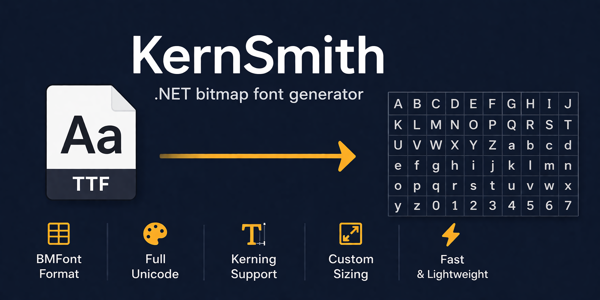

<p align="center">
  
</p>

<p align="center">
  <a href="LICENSE">License</a> &middot;
  <a href="CHANGELOG.md">Changelog</a> &middot;
  <a href="samples/KernSmith.Samples/">Samples</a>
</p>

## Features

- **Font format support** -- TTF, OTF, WOFF, and WOFF2 input
- **BMFont output** -- text, XML, and binary `.fnt` formats with `.png` atlas pages
- **GPOS kerning** -- extracts kerning pairs directly from OpenType GPOS tables
- **Atlas packing** -- MaxRects (default) and Skyline algorithms with autofit, power-of-two, and non-square texture support
- **Outline rendering** -- configurable width and color
- **Gradient fill** -- per-glyph vertical/angled gradients with midpoint control
- **Drop shadow** -- offset, blur radius, color, and opacity
- **SDF rendering** -- signed distance field output for resolution-independent text
- **Super sampling** -- 2x-4x rasterization with box-filter downscale for smoother edges
- **Variable fonts** -- set variation axes (weight, width, slant, etc.)
- **Color fonts** -- COLR/CPAL emoji and color glyph rendering with palette selection
- **Channel packing** -- pack multiple glyphs into RGBA channels for compact atlases
- **Per-channel compositing** -- independent control of what each RGBA channel contains (glyph, outline, both, zero, one)
- **Font subsetting** -- only parses tables for requested codepoints
- **Custom glyphs** -- replace or add glyphs with user-supplied images
- **Texture formats** -- PNG (default), TGA, and DDS atlas output
- **Reading BMFont files** -- load and parse existing `.fnt` files (auto-detects text/XML/binary)
- **Fluent builder API** -- chainable configuration as an alternative to options objects
- **System font loading** -- generate from installed fonts by family name
- **Fully in-memory** -- entire pipeline runs without touching disk unless you call `ToFile()`
- **Batch generation** -- parallel multi-font generation with font caching
- **Pipeline metrics** -- stage-level timing breakdown for profiling
- **Cross-platform** -- Windows, Linux, macOS via .NET 10.0

## Installation

```
dotnet add package KernSmith
```

Or via the NuGet Package Manager:

```
Install-Package KernSmith
```

## Quick Start

Generate a bitmap font from a `.bmfc` config file in one call:

```csharp
using KernSmith;

var result = BmFont.FromConfig("myfont.bmfc");
result.ToFile("output/myfont");
```

Generate from a TTF file using `FontGeneratorOptions`:

```csharp
var result = BmFont.Generate("path/to/font.ttf", new FontGeneratorOptions
{
    Size = 32,
    Characters = CharacterSet.Ascii
});

// Write .fnt + .png + .bmfc files to disk
result.ToFile("output/myfont");
```

For the simplest case, just pass a size:

```csharp
var result = BmFont.Generate("path/to/font.ttf", 48);
```

You can also pass raw font bytes:

```csharp
byte[] fontData = File.ReadAllBytes("path/to/font.ttf");
var result = BmFont.Generate(fontData, new FontGeneratorOptions
{
    Size = 24,
    Characters = CharacterSet.ExtendedAscii,
    Kerning = true
});
```

## Fluent Builder

The `BmFont.Builder()` API provides a chainable alternative:

```csharp
var result = BmFont.Builder()
    .WithFont("path/to/font.ttf")
    .WithSize(32)
    .WithCharacters(CharacterSet.Ascii)
    .WithPadding(1)
    .WithSpacing(1, 1)
    .WithKerning()
    .Build();

result.ToFile("output/myfont");
```

### Bold and Italic

```csharp
var result = BmFont.Builder()
    .WithSystemFont("Arial")
    .WithSize(32)
    .WithBold()                   // Uses native bold face, falls back to synthetic
    .WithItalic()                 // Uses native italic face, falls back to synthetic
    .Build();

// Force synthetic styling (skip native face lookup)
var result2 = BmFont.Builder()
    .WithSystemFont("Arial")
    .WithSize(32)
    .WithForceSyntheticBold()     // Always applies synthetic bold
    .WithForceSyntheticItalic()   // Always applies synthetic italic
    .Build();
```

- `WithBold()` / `WithItalic()` use the native bold/italic face when available (system fonts), falling back to synthetic
- `WithForceSyntheticBold()` / `WithForceSyntheticItalic()` always apply synthetic styling, skipping native face lookup
- When using a file path (not a system font), bold/italic is always synthetic -- `WithBold()` and `WithForceSyntheticBold()` produce identical results
- For native vs synthetic distinction, use `WithSystemFont()` so the font family can be searched for a matching face

You can also start the builder from a `.bmfc` config and override individual settings:

```csharp
var result = BmFont.Builder()
    .FromConfig("base.bmfc")
    .WithSize(48)
    .Build();
```

## System Fonts

Generate from a system-installed font by family name:

```csharp
var result = BmFont.GenerateFromSystem("Arial", new FontGeneratorOptions
{
    Size = 36,
    Characters = CharacterSet.Ascii
});
```

Or with the builder:

```csharp
var result = BmFont.Builder()
    .WithSystemFont("Arial")
    .WithSize(36)
    .WithCharacters(CharacterSet.Latin)
    .Build();
```

## Batch Generation

Generate multiple fonts in parallel with shared font caching:

```csharp
// Batch generate multiple fonts with parallel execution
var jobs = new List<BatchJob>
{
    new BatchJob { SystemFont = "Arial", Options = new FontGeneratorOptions { Size = 32 } },
    new BatchJob { SystemFont = "Arial", Options = new FontGeneratorOptions { Size = 48, Bold = true } },
    new BatchJob { FontPath = "custom.ttf", Options = new FontGeneratorOptions { Size = 24 } },
};

var result = BmFont.GenerateBatch(jobs, new BatchOptions { MaxParallelism = 4 });

foreach (var job in result.Results)
{
    if (job.Success)
        job.Result!.ToFile($"output/font-{job.Index}");
}
```

### Font Cache

Pre-load fonts for reuse across multiple generations:

```csharp
// Pre-load fonts for reuse across multiple generations
var cache = new FontCache();
cache.LoadSystemFont("Arial");
cache.LoadFile("custom.ttf");

var result = BmFont.GenerateBatch(jobs, new BatchOptions
{
    FontCache = cache,
    MaxParallelism = 4
});
```

### Pipeline Metrics

Profile pipeline stages to identify bottlenecks:

```csharp
// Profile pipeline stages
var result = BmFont.Generate(fontData, new FontGeneratorOptions
{
    Size = 32,
    CollectMetrics = true
});

Console.WriteLine(result.Metrics); // Prints stage-level timing breakdown
```

## Character Sets

Several presets are available, and you can define custom sets:

```csharp
// Built-in presets
CharacterSet.Ascii           // U+0020..U+007E (95 printable ASCII characters)
CharacterSet.ExtendedAscii   // U+0020..U+00FF (includes accented Latin characters)
CharacterSet.Latin           // ASCII + Latin Extended-A + Latin Extended-B

// From a string of characters
var custom = CharacterSet.FromChars("ABCDabcd0123!@#$");

// From Unicode ranges
var cyrillic = CharacterSet.FromRanges((0x0400, 0x04FF));

// Combine multiple sets
var combined = CharacterSet.Union(CharacterSet.Ascii, cyrillic);
```

## Effects

### Outline

```csharp
var result = BmFont.Generate("font.ttf", new FontGeneratorOptions
{
    Size = 48,
    Characters = CharacterSet.Ascii,
    Outline = 2  // 2-pixel black outline
});
```

With a colored outline:

```csharp
var result = BmFont.Generate("font.ttf", new FontGeneratorOptions
{
    Size = 48,
    Characters = CharacterSet.Ascii,
    Outline = 3,
    OutlineR = 255,  // Red outline
    OutlineG = 0,
    OutlineB = 0
});
```

### Gradient

```csharp
var result = BmFont.Generate("font.ttf", new FontGeneratorOptions
{
    Size = 48,
    Characters = CharacterSet.Ascii,
    GradientStartR = 255, GradientStartG = 255, GradientStartB = 0,  // Yellow top
    GradientEndR = 255, GradientEndG = 0, GradientEndB = 0,          // Red bottom
    GradientAngle = 90f,   // Top-to-bottom (default)
    GradientMidpoint = 0.5f
});
```

### Shadow

```csharp
var result = BmFont.Generate("font.ttf", new FontGeneratorOptions
{
    Size = 48,
    Characters = CharacterSet.Ascii,
    ShadowOffsetX = 2,
    ShadowOffsetY = 2,
    ShadowBlur = 3,
    ShadowR = 0, ShadowG = 0, ShadowB = 0,  // Black shadow
    ShadowOpacity = 0.8f
});
```

For a crisp, uniform silhouette instead of soft antialiased edges, enable hard shadow:

```csharp
var result = BmFont.Builder()
    .WithFont("font.ttf")
    .WithSize(48)
    .WithCharacters(CharacterSet.Ascii)
    .WithShadow(2, 2, 0)
    .WithHardShadow()
    .Build();
```

### Combining Effects

All effects can be combined. They are composited in fixed order: shadow (back), outline (middle), gradient (front).

```csharp
var result = BmFont.Builder()
    .WithFont("font.ttf")
    .WithSize(64)
    .WithCharacters(CharacterSet.Ascii)
    .WithOutline(2, 0, 0, 0)
    .WithGradient((255, 200, 0), (255, 50, 0), angleDegrees: 90f)
    .WithShadow(offsetX: 3, offsetY: 3, blur: 4, color: (0, 0, 0), opacity: 0.6f)
    .Build();
```

## Output Formats

### Write to Disk

```csharp
// Text format (default)
result.ToFile("output/myfont");

// XML format
result.ToFile("output/myfont", OutputFormat.Xml);

// Binary format
result.ToFile("output/myfont", OutputFormat.Binary);
```

`ToFile` writes the `.fnt` descriptor, all `.png` atlas pages, and a `.bmfc` config file (when source options are available).

### In-Memory Access

Convenience properties give you the `.fnt` content without calling a formatter directly:

```csharp
// BMFont text format
string fntText = result.FntText;

// BMFont XML format
string fntXml = result.FntXml;

// BMFont binary format
byte[] fntBinary = result.FntBinary;

// Encode atlas pages to PNG/TGA/DDS byte arrays
byte[][] pngFiles = result.GetPngData();
byte[] firstPng = result.GetPngData(0);
byte[][] tgaFiles = result.GetTgaData();
byte[][] ddsFiles = result.GetDdsData();

// Round-trip: export the config that produced this result
string bmfcText = result.ToBmfc();
```

The older `ToString()`, `ToXml()`, and `ToBinary()` methods still work and return the same data.

### MonoGame / Game Engine Integration

Generate a bitmap font and load it straight into your engine without writing temp files:

```csharp
var result = BmFont.FromConfig("ui-font.bmfc");

// Feed these to your engine's SpriteFont or BMFont loader
string fntText = result.FntText;
byte[] pngBytes = result.GetPngData(0);
```

### Raw Pixel Access

You can also access the raw RGBA pixel data on each atlas page:

```csharp
foreach (var page in result.Pages)
{
    byte[] rgba = page.PixelData;
    int width = page.Width;
    int height = page.Height;

    // Encode individual pages to other formats
    byte[] tga = page.ToTga();
    byte[] dds = page.ToDds();
}
```

## Reading and Writing .bmfc Config Files

Use `BmfcConfigReader` and `BmfcConfigWriter` to work with `.bmfc` configuration files programmatically:

```csharp
using KernSmith;

// Read a .bmfc config file
BmfcConfig config = BmfcConfigReader.Read("path/to/font.bmfc");

// Or parse from a string
BmfcConfig config2 = BmfcConfigReader.Parse(bmfcContent);

// Modify and write back
BmfcConfigWriter.WriteToFile(config, "path/to/output.bmfc");

// Or serialize to a string
string bmfcText = BmfcConfigWriter.Write(config);
```

## Reading BMFont Files

Load an existing `.fnt` file (auto-detects text, XML, or binary format):

```csharp
// Load .fnt and associated .png atlas pages from disk
BmFontResult loaded = BmFont.Load("path/to/myfont.fnt");

// Access the model
var charCount = loaded.Model.Characters.Count;
var kerningCount = loaded.Model.KerningPairs.Count;

// Load just the model without atlas images
var model = BmFont.LoadModel(File.ReadAllBytes("myfont.fnt"));

// Or from a text-format string
var model2 = BmFont.LoadModel(fntTextContent);
```

## CLI Tool

A reference command-line tool is included in `tools/KernSmith.Cli/`. See the [CLI README](tools/KernSmith.Cli/README.md) for usage.

Available commands: `generate`, `init`, `batch`, `benchmark`, `inspect`, `convert`, `list-fonts`, `info`.

The `init` command generates a `.bmfc` config file from CLI flags without rendering a font, so you can scaffold a config and tweak it by hand.

Use `--time` to display elapsed time or `--profile` to show a full pipeline stage breakdown.

## Advanced Features

### SDF (Signed Distance Fields)

```csharp
var result = BmFont.Generate("font.ttf", new FontGeneratorOptions
{
    Size = 48,
    Characters = CharacterSet.Ascii,
    Sdf = true
});
```

Note: SDF cannot be combined with super sampling (`SuperSampleLevel > 1`).

### Variable Fonts

```csharp
var result = BmFont.Builder()
    .WithFont("variable-font.ttf")
    .WithSize(32)
    .WithVariationAxis("wght", 700)  // Bold weight
    .WithVariationAxis("wdth", 75)   // Condensed width
    .Build();
```

### Color Fonts

```csharp
var result = BmFont.Generate("color-emoji.ttf", new FontGeneratorOptions
{
    Size = 64,
    ColorFont = true,
    ColorPaletteIndex = 0  // CPAL palette index
});
```

### Channel Packing

Pack glyphs into individual RGBA channels for 4x atlas density:

```csharp
var result = BmFont.Generate("font.ttf", new FontGeneratorOptions
{
    Size = 16,
    Characters = CharacterSet.Ascii,
    ChannelPacking = true
});
```

Channel packing cannot be combined with color font rendering.

### Font Subsetting

By default, only the TTF tables needed for your requested codepoints are fully parsed, keeping memory usage low for large CJK or Unicode fonts.

### Autofit Texture

Automatically find the smallest power-of-two texture size that fits all glyphs on a single page:

```csharp
var result = BmFont.Generate("font.ttf", new FontGeneratorOptions
{
    Size = 24,
    Characters = CharacterSet.Ascii,
    AutofitTexture = true
});
```

### Super Sampling

Rasterize at 2x-4x resolution and downscale for smoother edges:

```csharp
var result = BmFont.Generate("font.ttf", new FontGeneratorOptions
{
    Size = 32,
    Characters = CharacterSet.Ascii,
    SuperSampleLevel = 2
});
```

### Texture Formats

```csharp
var result = BmFont.Generate("font.ttf", new FontGeneratorOptions
{
    Size = 32,
    TextureFormat = TextureFormat.Tga  // Also: TextureFormat.Png, TextureFormat.Dds
});
```

## License

MIT. See [LICENSE](LICENSE) for details.
